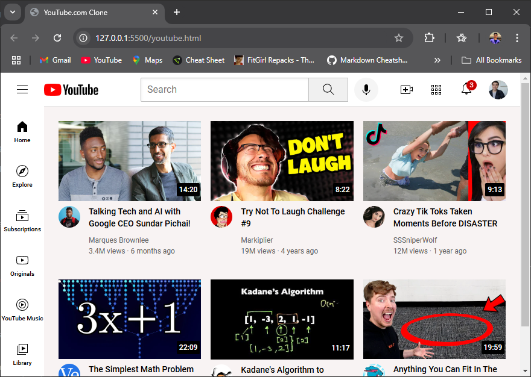

# YouTube.com Clone


This project is a **frontend clone** of YouTube, designed to mimic its core user interface features and layout. The application includes components such as a header, sidebar, video grid, and interactive elements to provide a seamless user experience.

## Features

### 1. **Header**
- **Search Bar**: Users can search for content.
- **Voice Search**: An interactive button for voice-based search.
- **User Icons**: Options for uploading videos, checking notifications, and managing user profiles.

### 2. **Sidebar**
- Navigation links to core sections of YouTube:
  - **Home**
  - **Explore**
  - **Subscriptions**
  - **Originals**
  - **YouTube Music**
  - **Library**

### 3. **Video Grid**
- Displays video previews with the following information:
  - Thumbnail with duration overlay.
  - Video title, author, views, and upload time.
  - Channel profile picture.

## Technologies Used

### **Frontend**
- **HTML**: Structure of the webpage.
- **CSS**: Styled using multiple CSS files:
  - `general.css`: General styling.
  - `header.css`: Header-specific styles.
  - `video.css`: Video grid and related styles.
  - `sidebar.css`: Sidebar styles.
- **Google Fonts**: Integrated the "Roboto" font for a modern and professional look.

### **Assets**
- **Icons**: Includes assets for search, notifications, voice search, and navigation.
- **Images**: Thumbnails and profile pictures for videos.

## Installation and Usage

### Prerequisites
Ensure you have a browser and a text editor installed.

### Steps to Run
1. Clone or download the repository to your local machine.
2. Open the `index.html` file in any modern web browser.

### Directory Structure
```
/styles
  ├── general.css
  ├── header.css
  ├── video.css
  ├── sidebar.css
/icons
  ├── hamburger-menu.svg
  ├── youtube-logo.svg
  ├── search.svg
  ├── upload.svg
  ├── notifications.svg
  ├── home.svg
  ├── explore.svg
  ├── subscriptions.svg
/thumbnails
  ├── thumbnail-1.webp
  ├── thumbnail-2.webp
/channel-pictures
  ├── my-channel.jpeg
  ├── channel-1.jpeg
```


## Acknowledgments
This project is created for educational purposes, inspired by the official YouTube design.

-
